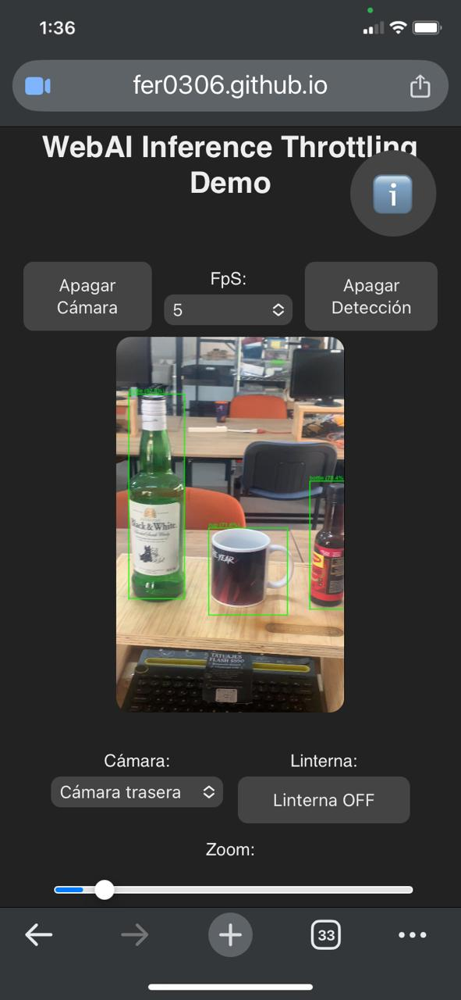

# WebAI Inference Throttling

> ℹ️ **Note for English readers:**  
> This project is originally written in Spanish, as it is the author's native language and part of its conceptual origin.  
>  
> For accessibility, you can use your browser’s built-in translation (Chrome, Edge, etc.) to read it in English.  
>  
> The Spanish version is preserved intentionally as part of the project's authorship and intellectual identity.

---

Machine Learning en tiempo real en el navegador, optimizado con **inference throttling**, capas inteligentes y técnicas de procesamiento eficientes.

Este proyecto demuestra cómo implementar **control inteligente de inferencias** en un modelo de IA ejecutado en el navegador usando **TensorFlow.js**, optimizando el uso de recursos en tiempo real, especialmente en dispositivos móviles, evitando bloqueos o sobrecarga cuando se realizan inferencias continuas desde la cámara.

Optimizando el rendimiento mediante:

- Procesamiento selectivo de cambios
- Arquitectura modular basada en capas inteligentes

El objetivo no es procesar más…  
👉 es **procesar mejor**.

---

## 🚀 TL;DR

WebAI Inference Throttling desacopla el flujo de inferencia en tiempo real mediante una arquitectura en capas + control dinámico de ejecución, logrando:

- Reducción significativa de inferencias innecesarias  
- Renderizado solo cuando hay cambios reales  
- Adaptación automática al hardware  

👉 No es rate limiting… es **control inteligente de inferencia en edge AI**.

---

## ✨ Características principales

- 📸 **Gestión avanzada de la cámara**
  - Cambio de cámara (frontal/trasera).
  - Soporte de diferentes resoluciones: QVGA, VGA, HD, FullHD, 4K.
  - Control de zoom y linterna (si el dispositivo lo permite).

- 🧠 **Inferencia optimizada con throttling**
  - Basado en `coco-ssd` de TensorFlow.js.
  - Configuración dinámica de frecuencia de inferencia (1–10 FPS).
  - Filtrado de clases de objetos (ejemplo: `cup`, `bottle`, `person`).

- 🎨 **Procesamiento de predicciones eficiente**
  - Dibuja bounding boxes en canvas.
  - Redibuja solo si las predicciones cambian → ahorro de recursos.

- 📱 **Interfaz adaptable (responsive)**
  - Controles intuitivos para cámara, linterna, zoom y FPS.
  - Compatible con desktop, tablet y móvil.

---

## ⚠️ ¿Por qué esto no es rate limiting?

Este proyecto no limita peticiones…

👉 controla **cuándo tiene sentido ejecutar inferencia**.

**Diferencias clave:**

| Enfoque | Qué hace |
|--------|--------|
| Rate limiting | Controla cantidad |
| Throttling tradicional | Controla frecuencia fija |
| WebAI Throttling | Controla **relevancia** |

**Decisiones basadas en:**
- Cambios reales en la escena  
- Capacidad del dispositivo  
- Estabilidad de predicciones  

---

## 🏗️ Arquitectura del proyecto

En lugar de correr el modelo en cada frame, la arquitectura desacopla el flujo
en cuatro capas independientes donde cada una tiene una responsabilidad clara
y se controla de forma autónoma.

Este proyecto sigue una arquitectura modular basada en capas inteligentes para optimizar el rendimiento:

1. **Capa de cámara (VideoController)**
   Flujo directo desde `getUserMedia()`, con soporte de cambio de cámara, encendido/apagado, zoom y linterna.
   Mejoras: cambio de resolución, pause y play.

2. **Capa de modelo (ModelController)**
   Administra la carga y ejecución del modelo `coco-ssd` de TensorFlow.js.
   - Permite configurar el *throttling* dinámico a las inferencias.
   - Soporta filtrado de clases.

3. **Capa de procesamiento de predicciones (PredictionProcessor)**
   Procesa las predicciones recibidas y decide cuándo actualizar comparando predicciones (bounding boxes, clases, scores).
   la visualización en el canvas. 

4. **Capa de renderizado en canvas (CanvasRenderer)**
   En la arquitectura final, esta capa se encargará de manejar de forma independiente el dibujado en el canvas.

```
┌───────────────────────────────────────────────────┐
│             CAPA 1 — VideoController              │
│        Flujo directo desde getUserMedia()         │
│        Sin canvas intermedios, cero carga         │
└─────────────────────────┬─────────────────────────┘
                          │ frames
┌─────────────────────────▼─────────────────────────┐
│             CAPA 2 — ModelController              │
│       Inferencia con ThrottleController           │
│       Solo corre cada N ms (heurística CPU)       │
└─────────────────────────┬─────────────────────────┘
                          │ predicciones crudas
┌─────────────────────────▼─────────────────────────┐
│             CAPA 3 — VectorProcessor              │
│    - Comparación directa de vectores por índice   │ [Implementado]
│    - Comparación vectorial con umbral adaptado    │ [Implementado]
│    - Tracking con IoU e identidad persistente     │ [Implementado]
│                                                   │
│    - Extensible a nuevas técnicas de comparación  │ [Fuera del alcance del proyecto]
│                                                   │
│  Decide si hay cambio real                        │
└─────────────────────────┬─────────────────────────┘
                          │ solo si hay cambios
┌─────────────────────────▼─────────────────────────┐
│             CAPA 4 — CanvasRenderer               │
│          Draw call solo cuando es necesario       │
│         Sin parpadeo, sin redraw innecesario      │
└───────────────────────────────────────────────────┘
```
👉 Ver detalle completo: docs/architecture.md

> ### 🧩 Nota sobre autonomía
> 
> La arquitectura de 4 capas es funcional y viable por sí sola.
> Cada capa opera de forma independiente — **la autonomía del sistema
> es un problema abierto** que cada desarrollador puede resolver
> según su caso de uso, hardware y contexto.
> 
> En este proyecto se incluye un módulo auxiliar (`ThrottleController`)
> que representa **una solución particular** a ese problema:
> calibración automática del dispositivo y ajuste dinámico de FPS
> según el presupuesto de CPU disponible.
> 
> No es la única forma de lograrlo — es la que funcionó aquí.
> 
> 👉 Ver desarrollo completo de esta solución: [`evolution_throttle_controller.md`](./docs/project-evolution/evolution_throttle_controller.md)

---

## ⚡ Optimización y rendimiento

Este proyecto está diseñado para funcionar en dispositivos reales, incluyendo hardware limitado.

### Estrategias utilizadas:

- Reducción dinámica de FPS
- Ajuste de resolución
- Pausa automática por inactividad
- Eliminación de draw calls innecesarios
- Procesamiento basado en cambios

👉 Más detalles: `docs/performance.md`

---

## 🧪 Técnicas implementadas

El sistema evoluciona a través de distintas técnicas de procesamiento en la Capa 3:

### ✅ Implementado

- Comparación por índice
- Vector diff
- IoU tracking
- Throttle dinámico
- Filtro de clases
- Anti-parpadeo
- Identidad persistente

### 🔧 Identificado — pendiente de implementar

- Validación por tamaño de objeto
- Suavizado de coordenadas
- NMS manual
- Activación por detección de movimiento (pixel wakeup)

### 🔭 Fuera del alcance del proyecto (Roadmap)

- **Kalman Filter**
- **Hungarian Algorithm**
- **DeepSORT**
- **Modelos ligeros alternativos**

👉 Ver explicación completa: `docs/techniques.md`

---

## 🧭 Explorar el proyecto

### 🎮 Demostracion

Ubicados en:

```
src/demos/
```

## 🧪 Objetos detectados en la demo

Esta demo está configurada para detectar **únicamente los siguientes objetos**:

- ☕ tazas - `cup`
- 🧴 botellas - `bottle`
- 👤 🚶 personas - `person`

Esto se debe a que se aplica un **filtro de clases** para reducir la carga de procesamiento y enfocarse en un caso de uso específico.
Puedes modificar o ampliar este filtro desde la variable (`filterClasses`) en los archivos (`html`).

Versiones disponibles:

- `v1-three-layers`
- `v2-four-layers`
- `v3-vectordiff`
- `v4-ioutracker`

🎮 **[¡Probar la demo en vivo! →](https://fer0306.github.io/webai-inference-throttling/index.html)**

---

### 🧠 Historia y Evolución completa de este proyecto

Incluye todas las fases del desarrollo:

- Control de cámara
- Canvas overlay
- Primeras detecciones
- Throttling
- Heurísticas
- Arquitectura por capas
- Tracking avanzado

👉 Ver narrativa completa: [`project_history.md`](./docs/project_history.md) 

---

### 📊 Laboratorio

Ubicado en:

```
src/lab/
```

Incluye pruebas y métricas de:

- Vector Diff
- IoU Tracker

---

## 📂 Estructura del proyecto

```
webai-inference-throttling/
│
├── 🛠️ assets/                       ←  Recursos para el repositorio.
│
├── 📘 docs/                          ←  Documentación técnica, conceptual y referencias.
│   │
│   ├── 📈 project-evolution/         ←  Demostraciones para el usuario prueba
│   │   ├── evolution_3_to_4_layers.md         ← Separación de lógica y render
│   │   ├── evolution_throttle_controller.md   ← Evolución del sistema heurístico de control de inferencias
│   │   └── evolution_vector_processor.md      ← Evolución del procesamiento de predicciones
│   │
│   ├── architecture.md                  ← Diseño completo de la arquitectura en 4 capas
│   ├── installation.md                  ← Guía para ejecutar el proyecto localmente
│   ├── performance.md                   ← Estrategias de optimización aplicadas
│   ├── project_history.md               ← Historia y Evolución completa del proyecto
│   └── techniques.md                    ← Técnicas implementadas y roadmap de mejoras
│
├── 💻 src/
│   ├── 👁️ demos/                     ←  Demostraciones para el usuario prueba
│   │   ├── v1-three-layers/              ← 3 capas (Ptototipo inical para crear la arquitectura definida)
│   │   ├── v2-four-layers/               ← 4 capas (Arquitectura definida completamente y corectamente)
│   │   ├── v3-vectordiff/                ← 4 capas + Comparación simple por vectores
│   │   ├── v4-ioutracker/                ← 4 capas + IoU tracker
│   │   └── readme-demos-section.md       ← Documentación detallada de los demos
│   │
│   ├── 🕰️ history/                   ←  Evolución real del proyecto
│   │   │
│   │   ├── phase1-camera/
│   │   │   └── p1-camera-control.html               ← Dominar la cámara
│   │   │
│   │   ├── phase2-canvas/
│   │   │   └── p2-canvas-overlay-fixed.html         ← Canvas responsivo encima del video
│   │   │
│   │   ├── phase3-detection/                        ← Primera detección real
│   │   │   ├── p3a-detection-history-v1.html        ← Primera comparación de historial, bug de acumulación
│   │   │   ├── p3b-detection-throttle-time.html     ← Throttling por tiempo + resolución baja
│   │   │   ├── p3c-detection-history-v2.html        ← Corrección del bug: reemplazar estado
│   │   │   ├── p3d-detection-throttle-ui.html       ← Throttling controlado desde la UI
│   │   │   ├── p3e-spaghetti-controls-hidden.html   ← Controles ocultos, UI limpia
│   │   │   ├── p3f-spaghetti-controls-visible.html  ← Controles UI expuestos, base funcional
│   │   │   └── p3g-spaghetti-pixel-wakeup.html      ← Auto-reactivación por detección de movimiento en píxeles
│   │   │
│   │   ├── phase4-heuristic/
│   │   │   └── p4-heuristic-module.html             ← Módulo heurístico autónomo (calibración automática + FPS adaptativo)
│   │   │
│   │   ├── phase5-layers/
│   │   │   ├── p5a-three-layers.html                 ← Arquitectura de 3 capas (Prototipo inicial)
│   │   │   └── p5b-four-layers.html                  ← arquitectura de 4 capas
│   │   │
│   │   └── phase6-smart-throttle/
│   │       ├── p6a-webai-throttling-vectordiff.html  ← Comparación simple por vectores
│   │       └── p6b-webai-throttling-ioutracker.html  ← Object Tracker con IoU
│   │
│   └── 📊 lab/                                   ←  Laboratorios y Mediciones
│          ├── lab1-vectordiff-metrics.html           ← Mediciones para Comparación simple por vectores
│          └── lab2-ioutracker-metrics.html           ← Mediciones para Object Tracker con IoU
│
├── index.html                        ← 🎮 menú visual de demos
├── ⚖️ LICENSE                        ← MIT.
├── ⚖️ LICENSE.md                     ← MIT - Versión Markdown para lectura en GitHub.
├── 🧾 LICENSE_CC                     → Creative Commons BY 4.0 (documentación).
├── 🧾 LICENSE_CC.md                  → CC BY 4.0 - Versión Markdown para lectura en GitHub.
└── README.md                         ← 🧭 entrada principal
```

---

## 🌍 Impacto

Este enfoque no solo mejora el rendimiento en dispositivos móviles, también:

- Reduce el consumo de CPU/GPU
- Disminuye el sobrecalentamiento
- Optimiza el uso de batería
- Reduce la carga en infraestructura cloud

👉 Promueve un modelo **edge AI (distribuido) más eficiente y sostenible**

---

## 🧠 Filosofía

- No todos los frames necesitan inferencia  
- No todas las predicciones deben renderizarse  
- No todo debe procesarse constantemente  

👉 La eficiencia está en el diseño, no está en procesar más…
👉 está en saber cuándo NO procesar.

---

## 📘 Referencias externas

- [Medium – WebAI: Machine Learning en tiempo real controlando inference throttling + capas inteligentes con TensorFlow.js en navegadores](https://medium.com/@fernandofa0306/webai-machine-learning-en-tiempo-real-controlando-inference-throttling-capas-inteligentes-con-tf-86de74fbdcfb)

---

## 📸 Capturas de pantalla



---

## 📝 Licencia

Este proyecto utiliza un esquema de licencias dual:

- **Código:** [MIT](./LICENSE.md)  
  Permite uso, modificación y distribución, siempre manteniendo la atribución al autor original.

- **Documentación, textos y diagramas:** [Creative Commons BY 4.0](./LICENSE_CC.md)  
  Permite compartir y adaptar el contenido, dando crédito al autor.

> 📸 Las imágenes, diagramas y logotipos incluidos en la carpeta [`/assets/`](./assets/)  
> forman parte del material documental y están cubiertos por la licencia **Creative Commons BY 4.0**.  
> Su reutilización requiere atribución explícita a *Fernando Flores Alvarado*.

---

## 👨‍💻 Autor

**Fernando Flores Alvarado**  
**OWASP Project Leader (México)**  
- 📧 fernando.alvarado@owasp.org
- 📧 fernandofa0306@gmail.com
- 💼 [LinkedIn Profile](https://www.linkedin.com/in/fernando-flores-alvarado-2786b21b8/)
- 🔗 [Medium Articles](https://medium.com/@fernandofa0306)

> *"Compartir con responsabilidad es inspirar para construir el futuro."*

---

**© 2025 Fernando Flores Alvarado — Todos los derechos reservados bajo las licencias indicadas.**  
Este contenido forma parte del proyecto **WebAI Inference Throttling** bajo esquema de licencias dual  
(*MIT* para código + *CC BY 4.0* para documentación).
